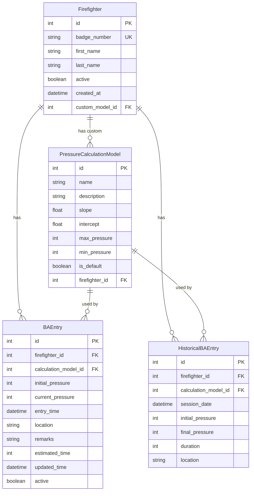

## Insallations
pip install -r backend/requirements.txt

## Starting Backend
cd backend
python init_db.py  # Only first time
flask run

## Starting Frontend
cd frontend
npm install
npm run dev

## Basic View

## Mermaid UML

